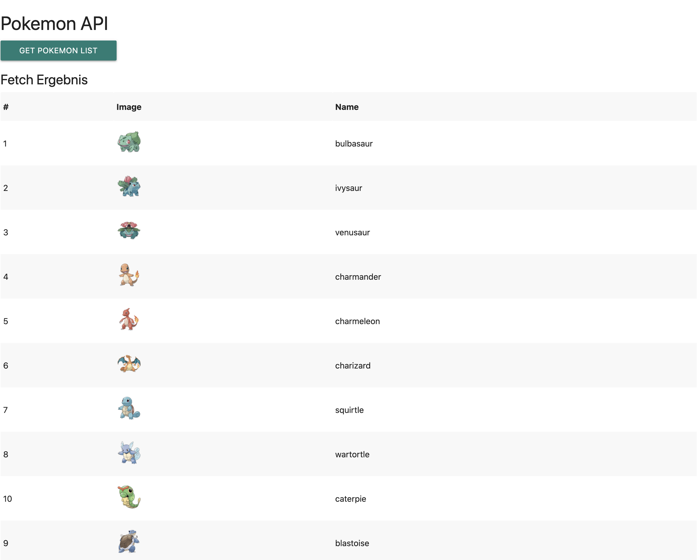

# API Fetch

In this exercise the first steps in Javascript in combination with HTML and CSS should be made. For this purpose a website will be created, which displays the results of a Javascript [fetch()](https://www.geeksforgeeks.org/javascript-fetch-method/) call as soon as they are loaded.

The beautiful and free [pokeapi](https://pokeapi.co/docs/v2) can be used as API. The API can be called directly when loading the page or by pressing a button. The results can then be displayed in an HTML table and made beautiful using CSS.

##### Example Result:

#### Working Steps
- Install a code editor of your choice to create HTML, CSS and Javascript files
- See how you can embed Javascript into your HTML page and how to call it up.
- Find out about the Javascript function fetch. You can find a nice video [here](https://www.youtube.com/watch?v=Oive66jrwBs).
- Check out the Pokeapi documentation on how to interact with the API to get your desired results.
- Show the results of your fetch call in a nice table on your page.

#### Tips

- As code editor we recommend and use [VS Code](https://code.visualstudio.com/)
- To access your page in your browser and see changes in real time, you can use the VS Code extension Live Server (ritwickdey.liveserver).
- Use the call [console.log()](https://www.w3schools.com/jsref/met_console_log.asp) to display data at certain points in your script.
- Create a Javascript [object](https://www.w3schools.com/js/js_objects.asp) for each pokemon, which you store in an [array](https://www.w3schools.com/js/js_arrays.asp).

#### Extras
- Add 2 buttons to browse between the 20 results of the API. (pagination)
- Add a search bar that allows you to search for Pokemon by its ID
