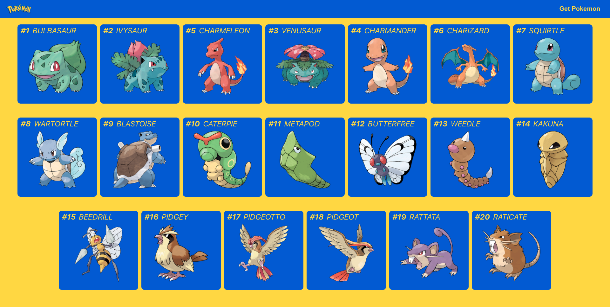

# React

In this exercise we will create a first React App! :fire:

In order to link to the first exercise "API Fetch", this application should be rebuilt as a React App.

We will create a React app that calls the [pokeapi](https://pokeapi.co/docs/v2) and displays the pokemon in a list. 
The app should get a header, where next to a title there should be a button to trigger the API fetch.
Underneath it should be a list of Pokemon with pictures and any information.

#### Example Solution

#### Working Steps
- The central manifest of the Javascript application is the package.json. Get an overview of what it is needed for and what information you can find or store [here](https://nodejs.dev/learn/the-package-json-guide). 
- Get an overview what react is used for and what advantages it has. [Documentation](https://reactjs.org/) [Tutorial](https://www.youtube.com/watch?v=sBws8MSXN7A)
- Create a react app with the [create-react](https://reactjs.org/docs/create-a-new-react-app.html) call 
- Use Google to understand the tasks of the individual files which are unclear to you.
- Create components for the header, the pokemonlist and the listitem
- Pass the function call of the button from the header to the Pokemonlist, which storred the Pokemon.
- Use [styled-components](https://styled-components.com/) to create nice components which do not need an extra css file and are great for reuse.

#### Tips
- Use [useState](https://reactjs.org/docs/hooks-state.html) to store your Pokemon in an Array
- Reuse your Api Fetch function from exercise 1
- Wenn du Probleme hast, einzelne Objekte dem Array in deinem useState hinzuzufügen, nutze den [Javascript Spread Operator](https://developer.mozilla.org/en-US/docs/Web/JavaScript/Reference/Operators/Spread_syntax) wie [hier](https://medium.com/javascript-in-plain-english/how-to-add-to-an-array-in-react-state-3d08ddb2e1dc).
- Use Functional Components for your components

#### Extras 
- If you click on a listitem, an overview page could be opened to show more information and pictures. [The React Router](https://www.youtube.com/watch?v=Law7wfdg_ls) can be used for this.
- You can also implement the additional tasks from task 1

